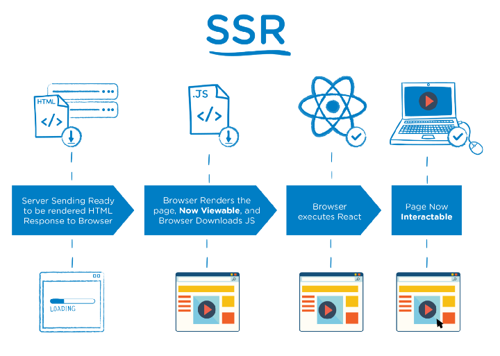
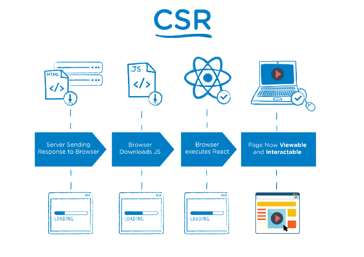

# Server Side Rendering (SSR)

Esse repositório contém algumas POCs e material para configuração de SSR em Vue, React e Angular, explorando algumas opções existentes no mercado.

## Conceitos

* Universal app - É quando o código da aplicação consegue rodar em multiplos ambientes
* Isomorphic app - Diz respeito a capacidade da aplicação ser alternada entre client e server sem parter o estado dela.
* SSR - Server side rendering.
* CSR - Client side rendering
* SEO -  Search Engine Optimization, conjunto de tecnicas de otimização que visam alcançar bons rankins orgânicos em buscadores, aumento o potencial de novos clientes encontrarem o site nesses mecanismos de pesquisa.
* Single Page Application - É o conceito de renderizar templates e código javascript para montagem de telas no browser. A experiência é de ter várias páginas, mas por baixo é uma aplicação única, carrega uma vez só.

## O que é Server Side Rendering

É o processo de renderizar um framework JavaScript no servidor, renderizando HTML e CSS estático. 

É possível fazer SSR com frameworks como React, Preact, Angular, Vue.js, Ember, entre outros. Esses frameworks trabalham no modelo Single Page Application, onde embora a navegação fique fluída e instantânea, o first load da aplicação fica comprometido, devido a necessidade de processar os templates JavaScript no Browser.

SSR consiste basicamente em processar no servidor o que é mais crítico para rodar a página e entregar ao cliente.

## Benefícios

- SEO - Quando os crawlers dos buscadores tentam interpretar a página recebem um index.html sem nada e dão score baixo para a página.
- Desempenho - Deixar todo o processamento da página no lado do cliente em alguns casos, como mobile e dispositivos mais lentos, pode influenciar na perfomance, entregando um pré-loading da página com os dados processados no servidor pode agilizar o first load da página.
- Exibe o first load da aplicação mais rápido


## Server Side Rendering x Client Side Rendering

O processo de renderizar o framework, baixa-lo, buscar os dados para preencher os componentes até exibir para o usuário, é feito tanto via SSR quanto CSR. A principal diferença como podemos ver nos diagramas a seguir, é que no SSR enquanto esses downloads ocorrem o usuário já consegue interagir com a página.

### SSR



### CSR



## Opções de SSR

- Hypernova Airbnb
- Next 
- Nuxt
- Angular Universal App
- After.js
- Gerador Razzler

## SSR específicos por linguagem

### Vue (create-nuxt-app)

#### Criação de um projeto com SSR
Ter o npx instalado na máquina

```bash
npm install -g npx
```

Instalar o create-nuxt-app
```bash
npx create-nuxt-app <project-name>
```
Ir selecionando as opções

* Project name - nome do projeto, default de onde a pasta esta
* Project description
* Custom server framework - opções são express, koa, adonis, hapi, feathers e micro
* Selecionar algumas features - PWA, Linter (configuração de LINT), prettier (ajuda na formatação do código) e Axios (HTTP requests)
* Framework de UI - bootstrap, vuetify, bulma, tailwind, element-ui, buefy
* Framework de teste - jest ou ava
* Rendering mode - universal app ou SPA. Selecione universal para ser SSR

#### Considerações

- O método asyncData no index.vue é responsável por hidratar o componente com dados no first loading da aplicação. Assim antes de entregar para o browser, ele faz a request de posts e já entrega o componente com os dados renderizados.
- Para rodar o projeto em modo dev - npm run dev.

### Angular (Universal App)

 #### Criação da aplicação

Instalar angular-cli

```Bash
npm install -g @angular/cli 
```

Criar a aplicação via angular-cli

 ```Bash
 ng new some-amazing-project
 ```

Adicionar as configs de SSR
 ```Bash
 ng add @nguniversal/express-engine --clientProject [name]
 ```

 Após esse comando será adicionado alguns arquivos como webpack.server.config, main.server.ts, server.ts, os scripts no package.json e mais algumas configurações de SSR.


 ## Possibilidades futuras

 - Explorar Hypernova e uma nova abordagem de micro-fronts